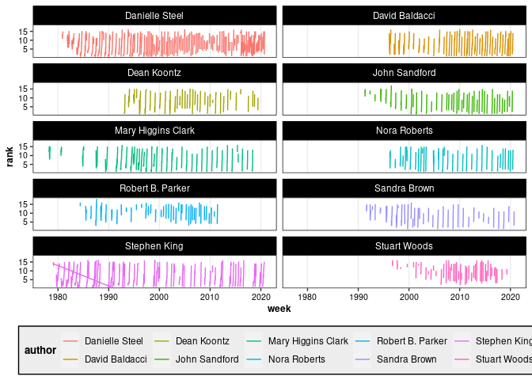

New York Times Bestsellers Analysis
================
Ryan Heslin
May 27, 2022


``` r
library(tidyverse)

nyt_titles <- read_tsv("https://raw.githubusercontent.com/rfordatascience/tidytuesday/master/data/2022/2022-05-10/nyt_titles.tsv")
nyt_full <- read_tsv("https://raw.githubusercontent.com/rfordatascience/tidytuesday/master/data/2022/2022-05-10/nyt_full.tsv")
```

# Largest Rank Gaps

Which books had the longest gaps between debt rank and best rank?

``` r
nyt_full |>
  group_by(title_id, title) |>
  summarize(
    rank_change = max(rank) - rank[which.min(week)],
    duration = cut(n(),
      breaks = c(0:9, seq(10, 100, by = 10), Inf),
      labels = as.character(
        c(
          1:10, paste(seq(10, 90, by = 10), seq(20, 100, by = 10), sep = "-"),
          "100+"
        )
      ),
      right = TRUE
    )
  ) |>
  ggplot(aes(x = rank_change)) +
  geom_bar(aes(fill = duration))
```


# Longest Reigns

Which books had the longest reigns? Most are familiar, but a few have
been forgotten. *The Robe*’s reign was not contiguous.

``` r
nyt_full |>
  group_by(title) |>
  summarize(length = n(), entrance = min(week), exit = max(week)) |>
  slice_max(n = 10, order_by = length)
```

    # A tibble: 10 × 4
       title                        length entrance   exit      
       <chr>                         <int> <date>     <date>    
     1 OH, THE PLACES YOU'LL GO!       178 1990-02-25 2000-07-09
     2 THE CELESTINE PROPHECY          165 1994-03-06 1997-06-15
     3 THE DA VINCI CODE               165 2003-04-06 2006-06-18
     4 THE BRIDGES OF MADISON COUN…    164 1992-08-16 1995-10-08
     5 ALL THE LIGHT WE CANNOT SEE     132 2014-05-25 2017-01-15
     6 THE CAINE MUTINY                123 1951-04-22 1953-09-27
     7 WHERE THE CRAWDADS SING         114 2018-09-23 2020-12-06
     8 AUNTIE MAME                     112 1955-02-20 1957-05-05
     9 THE ROBE                        111 1942-11-09 1954-03-07
    10 THE HELP                        108 2009-03-29 2011-09-25

So which had the longest contiguous reigns?

``` r
nyt_full |>
  group_by(title) |>
  summarize(longest_streak = with(rle(
    seq.Date(
      min(week),
      max(week),
      by = "weeks"
    ) %in%
      week
  ), max(lengths[values]))) |>
  slice_max(n = 10, order_by = longest_streak)
```

    # A tibble: 10 × 2
       title                         longest_streak
       <chr>                                  <int>
     1 THE BRIDGES OF MADISON COUNTY            162
     2 THE CELESTINE PROPHECY                   145
     3 THE CAINE MUTINY                         121
     4 AUNTIE MAME                              110
     5 ADVISE AND CONSENT                       100
     6 THE DA VINCI CODE                         98
     7 TO KILL A MOCKINGBIRD                     98
     8 THE HELP                                  96
     9 HAWAII                                    90
    10 THE AGONY AND THE ECSTASY                 83

# Most Represented Authors

Checking the most represented authors turns up some of the usual
suspects.

``` r
top_authors <- nyt_full |>
  distinct(title_id, .keep_all = TRUE) |>
  mutate(author = str_remove(author, "^.\\sby\\s")) |>
  count(author) |>
  slice_max(n = 10, order_by = n)

top_authors
```

    # A tibble: 10 × 2
       author                 n
       <chr>              <int>
     1 Danielle Steel       116
     2 Stuart Woods          63
     3 Stephen King          54
     4 Robert B. Parker      47
     5 John Sandford         44
     6 David Baldacci        42
     7 Dean Koontz           40
     8 Mary Higgins Clark    40
     9 Sandra Brown          40
    10 Nora Roberts          38

``` r
nyt_full |>
  filter(author %in% top_authors[["author"]]) |>
  ggplot(aes(x = week, y = rank, color = author)) +
  geom_line(aes(group = as.factor(title_id))) +
  facet_wrap(. ~ author, ncol = 2) +
  theme(legend.position = "bottom")
```



# Title Worlds

The most common title words paint something of a grim picture.

``` r
library(tidytext)

top_words <- nyt_full |>
  distinct(title_id, .keep_all = TRUE) |>
  unnest_tokens(word, title) |>
  anti_join(stop_words, by = "word")

top_words |>
  count(word) |>
  arrange(desc(n))
```

    # A tibble: 5,373 × 2
       word       n
       <chr>  <int>
     1 night     85
     2 love      76
     3 death     75
     4 house     69
     5 dark      65
     6 time      62
     7 life      51
     8 dead      50
     9 secret    46
    10 girl      44
    # … with 5,363 more rows

``` r
top_words |>
  semi_join(top_authors,
    by = "author"
  )
```

    # A tibble: 851 × 6
        year week        rank title_id author             word  
       <dbl> <date>     <dbl>    <dbl> <chr>              <chr> 
     1  1977 1977-03-27     8     6284 Stephen King       shini…
     2  1978 1978-03-26    12      242 Mary Higgins Clark stran…
     3  1978 1978-03-26    12      242 Mary Higgins Clark watch…
     4  1979 1979-01-21    15     6383 Stephen King       stand 
     5  1979 1979-09-09     8     4944 Stephen King       dead  
     6  1979 1979-09-09     8     4944 Stephen King       zone  
     7  1980 1980-07-27    13     4898 Mary Higgins Clark cradle
     8  1980 1980-07-27    13     4898 Mary Higgins Clark fall  
     9  1980 1980-08-24     6     1830 Stephen King       fires…
    10  1980 1980-11-02    13     6140 Danielle Steel     ring  
    # … with 841 more rows

``` r
author_words <- top_words |>
  group_by(author) |>
  summarize(word = paste(word, collapse = " "))
```

``` r
library(quanteda)
DFM <- tokens(author_words[["word"]]) |>
  setNames(author_words[["author"]]) |>
  dfm() |>
  dfm_tfidf(scheme_tf = "prop", base = exp(1))
```

Tf-idfs aren’t as distinctive as I hoped for every author, but some are
instantly recognizable.

``` r
tidy(DFM) |>
  rename(author = document) |>
  mutate(author = str_remove(author, "^.\\sby\\s")) |>
  filter(author %in% top_authors[["author"]]) |>
  group_by(author) |>
  slice_max(n = 10, order_by = count, with_ties = FALSE) |>
  mutate(term = fct_rev(reorder_within(term, count, author, FUN = mean))) |>
  ggplot(aes(x = term, y = count, fill = term)) +
  geom_col() +
  scale_x_reordered() +
  facet_wrap(. ~ author, ncol = 2, scales = "free") +
  labs(y = "Log tf-idf") +
  theme(
    legend.position = "none",
    axis.text.x = element_text(angle = 45, size = 9)
  )
```


