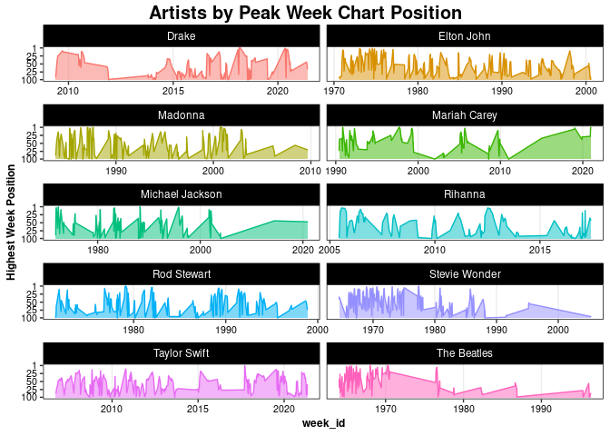
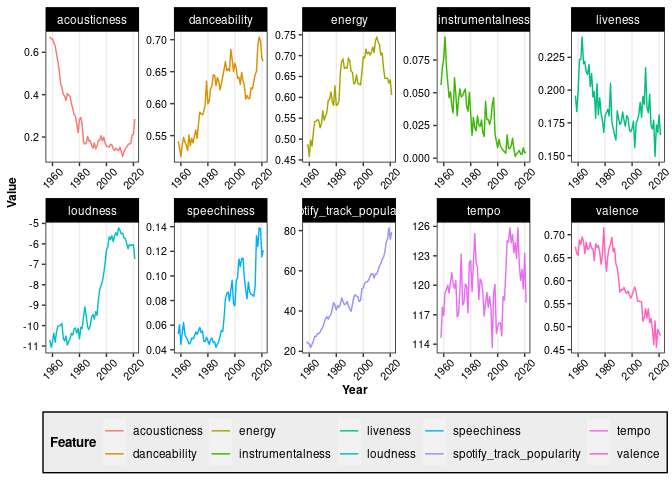
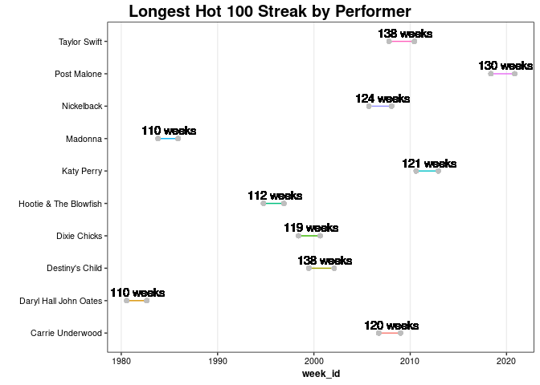

Billboard Charts Analsysis
================
Ryan Heslin
May 27, 2022


``` r
tuesdata <- tidytuesdayR::tt_load("2021-09-14")
```

``` 

    Downloading file 1 of 2: `billboard.csv`
    Downloading file 2 of 2: `audio_features.csv`
```

``` r
billboard <- tuesdata$billboard
audio <- tuesdata$audio_features |>
  group_by(song) |>
  mutate(instance = seq_len(n())) |>
  ungroup()
theme_standard <- ggplot2::theme(
  panel.background = element_blank(),
  panel.border = element_rect(color = "black", fill = NA),
  panel.grid = element_blank(), panel.grid.major.x = element_line(
    color =
      "gray93"
  ),
  legend.background = element_rect(fill = "gray93"), plot.title = element_text(
    size = 15,
    family = "sans", face = "bold", vjust = 1.3
  ), plot.title.position =
    "plot",
  plot.subtitle = element_text(size = 10, family = "sans"),
  legend.title = element_text(
    size = 10, family = "sans",
    face = "bold"
  ), axis.title = element_text(
    size = 9,
    family = "sans", face = "bold"
  ), axis.text = element_text(
    size = 8,
    family = "sans"
  ), strip.background = element_rect(
    color = "black",
    fill = "black"
  ), strip.text.x = element_text(color = "white"),
  strip.text.y = element_text(color = "white")
)
```

# Preliminary EDA

Total weeks on any position on the chart

``` r
ggplot2::theme_set(theme_standard)
billboard |>
  count(song, instance, sort = TRUE) |>
  slice_head(n = 10)
```

<div class="kable-table">

| song            | instance |   n |
| :-------------- | -------: | --: |
| Stay            |        1 | 208 |
| Hold On         |        1 | 200 |
| Angel           |        1 | 196 |
| I Like It       |        1 | 188 |
| Crazy           |        1 | 175 |
| You             |        1 | 172 |
| Heaven          |        1 | 168 |
| Forever         |        1 | 164 |
| Please Don’t Go |        1 | 152 |
| Without You     |        1 | 152 |

</div>

``` r
billboard |>
  group_by(song, instance) |>
  summarize(weighted = sum(101 - week_position)) |>
  ungroup() |>
  arrange(desc(weighted)) |>
  slice_head(n = 10)
```

<div class="kable-table">

| song        | instance | weighted |
| :---------- | -------: | -------: |
| Stay        |        1 |    13382 |
| I Like It   |        1 |    12373 |
| Angel       |        1 |    12026 |
| Crazy       |        1 |    10118 |
| Hold On     |        1 |    10062 |
| Heaven      |        1 |     9979 |
| Someday     |        1 |     9444 |
| Without You |        1 |     9251 |
| Forever     |        1 |     9206 |
| Closer      |        1 |     8466 |

</div>

What is it with “Stay”? Showing my age here. Remarkable it (well) stayed
on the charts that long.

``` r
billboard |>
  filter(song == "Stay") |>
  nrow()
```

    [1] 208

Not surprisingly, Christmas songs come back again … and again … and
again.

``` r
billboard |>
  group_by(song) |>
  summarize(duplicates = n_distinct(instance)) |>
  arrange(-duplicates) |>
  head(n = 10)
```

<div class="kable-table">

| song                                        | duplicates |
| :------------------------------------------ | ---------: |
| All I Want For Christmas Is You             |         10 |
| Rockin’ Around The Christmas Tree           |         10 |
| Jingle Bell Rock                            |          9 |
| The Christmas Song (Merry Christmas To You) |          9 |
| White Christmas                             |          8 |
| Goosebumps                                  |          7 |
| Thriller                                    |          7 |
| B.S.                                        |          6 |
| El Amante                                   |          6 |
| Heartless                                   |          6 |

</div>

Who spent the longest on the chart?

``` r
billboard |>
  group_by(performer) |>
  filter(week_position >= 10) |>
  summarize(top_10_weeks = n()) |>
  arrange(-top_10_weeks) |>
  head(n = 10)
```

<div class="kable-table">

| performer     | top\_10\_weeks |
| :------------ | -------------: |
| Taylor Swift  |            890 |
| Kenny Chesney |            758 |
| Elton John    |            752 |
| Tim McGraw    |            731 |
| Keith Urban   |            673 |
| Madonna       |            657 |
| Drake         |            624 |
| Rascal Flatts |            601 |
| Rod Stewart   |            581 |
| Brad Paisley  |            559 |

</div>

How about weeks *per song* in the top 10?

``` r
billboard |>
  filter(week_position > -10) |>
  group_by(performer) |>
  count(song) |>
  summarize(weeks_top_10 = sum(n)) |>
  arrange(-weeks_top_10) |>
  head(n = 10)
```

<div class="kable-table">

| performer     | weeks\_top\_10 |
| :------------ | -------------: |
| Taylor Swift  |           1022 |
| Elton John    |            889 |
| Madonna       |            857 |
| Kenny Chesney |            758 |
| Drake         |            746 |
| Tim McGraw    |            731 |
| Keith Urban   |            673 |
| Stevie Wonder |            659 |
| Rod Stewart   |            657 |
| Mariah Carey  |            621 |

</div>

# Plotting

``` r
top_artists <- billboard |>
  group_by(performer) |>
  summarize(weighted = sum(101 - week_position)) |>
  arrange(-weighted) |>
  slice_head(n = 10)
```

Artists by peak week song position.

``` r
billboard |>
  semi_join(top_artists) |>
  group_by(week_id) |>
  slice_max(week_position, n = 1) |>
  ungroup() |>
  mutate(week_id = lubridate::mdy(week_id)) |>
  ggplot(aes(
    x = week_id, y = 101 - week_position,
    color = performer, fill = performer
  )) +
  geom_area(alpha = .5) +
  scale_y_continuous(
    breaks = c(100, 75, 50, 25, 1),
    labels = c(1, 25, 50, 25, 100)
  ) +
  facet_wrap(~performer, ncol = 2, scales = "free_x") +
  labs(
    title = "Artists by Peak Week Chart Position",
    y = "Highest Week Position"
  ) +
  theme(legend.position = "none")
```



How do audio features vary across hits over time?

``` r
combined <- inner_join(billboard, audio, on = c("song", "performer"))
combined |>
  mutate(Year = lubridate::year(lubridate::mdy(week_id))) |>
  select(-c(mode, key, time_signature)) |>
  group_by(Year) |>
  summarize(across(danceability:last_col(), mean, na.rm = TRUE)) |>
  pivot_longer(danceability:last_col(),
    names_to = "Feature",
    values_to = "Value"
  ) |>
  ggplot(aes(x = Year, y = Value, color = Feature)) +
  geom_line() +
  facet_wrap(~Feature, nrow = 2, scales = "free") +
  theme(legend.position = "bottom", axis.text.x = element_text(angle = 45))
```



Who had the longest streaks of at least one song on the Hot 100?

``` r
longest_streak <- function(subscript, which = c("first", "last", "all")) {
  if (length(unique(subscript)) == 1L) {
    return(subscript)
  }
  comparator <- match.arg(which)
  comparator <- switch(comparator,
    "first" = min,
    "last" = max,
    "all" = c
  )
  unlist(with(
    rle(subscript),
    mapply(rep, values & seq_along(lengths) %in%
      comparator(which(lengths == max(lengths[values]))),
    lengths,
    SIMPLIFY = FALSE
    )
  ))
}
```

``` r
streaks <- billboard |>
  group_by(performer) |>
  filter(n() > 1) |>
  mutate(week_id = lubridate::mdy(week_id)) |>
  distinct(week_id, .keep_all = TRUE) |>
  arrange(week_id) |>
  mutate(
    streak = (week_id - 7) == lag(week_id, default = min(week_id) - 7),
    longest_streak = longest_streak(streak)
  ) |>
  filter(any(longest_streak)) |>
  mutate(
    start = week_id[min(which(longest_streak))],
    end = week_id[max(which(longest_streak))], max_streak = sum(longest_streak)
  ) |>
  filter(longest_streak) |>
  ungroup() |>
  filter(performer %in% names(sort(table(performer),
    decreasing = TRUE
  )[1:10])) |>
  mutate(y = as.integer(as.factor(performer)))
```

``` r
streaks |>
  ggplot(aes(x = week_id, y = performer, color = performer)) +
  geom_line() +
  geom_point(aes(x = start, y = y), col = "grey") +
  geom_point(aes(x = end, y = y), col = "grey") +
  geom_text(aes(label = paste(max_streak, "weeks"), x = end - 350, y = y + .25), color = "black") +
  labs(y = "", title = "Longest Hot 100 Streak by Performer") +
  theme(legend.position = "none")
```


