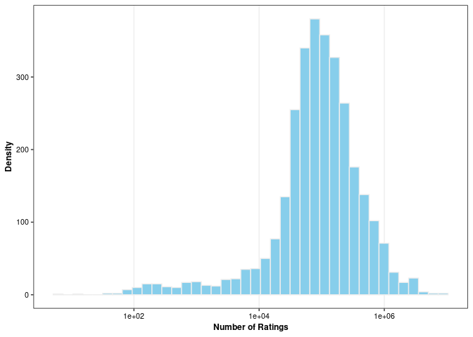
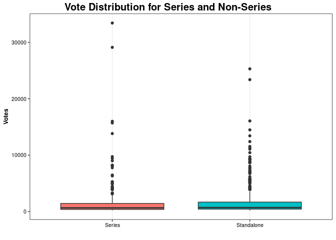
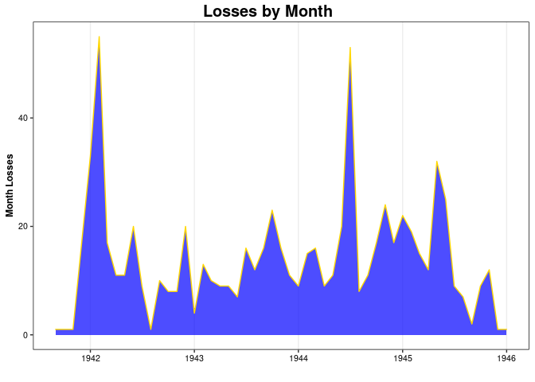
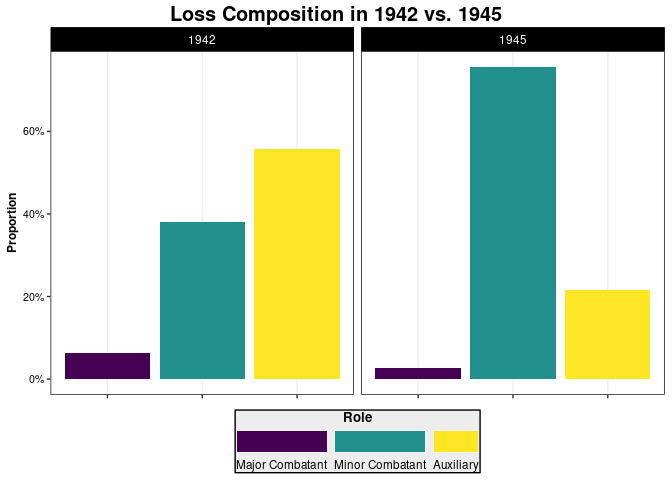
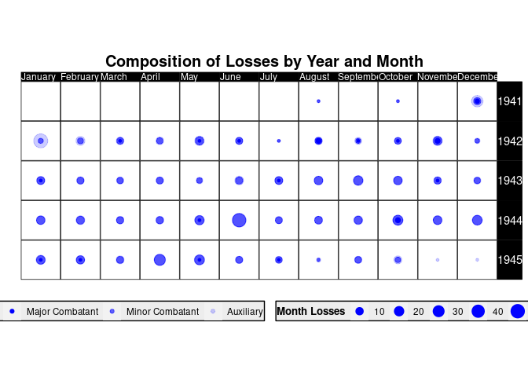

Books Analysis
================
Ryan Heslin
May 27, 2022


# The Best Books?

``` r
library(tidyverse)
library(rvest)
library(lubridate)
```

I scraped a list found on goodreads.com claiming to definitively rank
the best books. First I obtain the raw text.

``` r
pages <- 1:30
sel <-
  ".bookTitle span , .authorName span, .uitext a, #loading_link_555587, .minirating"

urls <- paste0("https://www.goodreads.com/list/show/1.Best_Books_Ever?page=", pages)
raw <- map(urls, ~ read_html(.x) %>%
  html_nodes(sel) %>%
  html_text())
```

Next I match the values of the text vector to the correct field and
pivot into a tibble.

``` r
books <- tibble(text = unlist(raw), field = rep(c("title", "author", "rating", "score", "voted"), times = length(text) / 5), rank = cumsum(field == "title")) %>%
  pivot_wider(values_from = text, names_from = "field")
```

Now I clean up the raw text.

``` r
extracts <-
  list(
    avg_rating = "(\\d.\\d{2})",
    num_ratings = "(^[^\\s]+)",
    score = "\\s(.*)",
    voted = "(^[^\\s]+)"
  )

books <-
  books %>%
  separate(rating,
    sep = " [^[a-zA-Z0-9.] ",
    into = c("avg_rating", "num_ratings")
  ) %>%
  mutate(
    across(names(extracts), ~ str_extract(.x, extracts[[cur_column()]])),
    across(-c(title, author), ~ str_remove_all(.x, ",") %>% as.numeric()),
    author = as.factor(author)
  )
```

The number of ratings has a somewhat skewed distribution.

``` r
autolab_plot <- function(call, mapping, ...) {
  call <- rlang::enexpr(call)
  label_plots(
    plot = eval(call, envir = parent.frame()), mapping = mapping,
    eval = TRUE, ...
  )
}

label_plots <- function(plot, mapping, eval = TRUE, ...) {
  if (!"ggplot" %in% class(plot)) {
    stop("Not a ggplot object")
  }
  vars <- plot$labels
  params <- mapping[names(mapping) %in% vars]
  vars <- setNames(params[match(vars, names(params))], names(plot$labels)) %>%
    compact()
  out <- make_labels(mapping = vars, ...)
  if (eval) {
    return(plot + out())
  }
  out
}

make_labels <- function(mapping = NULL, ...) {
  force(mapping)
  partial(labs, !!!mapping, ..., ... = )
}

bplot <- partial(ggplot, data = !!quote(books))

mapping <- list(
  title = "Title",
  author = "Author", avg_rating = "Average Rating",
  num_ratings = "Number of Ratings"
)
autolab_plot(call = bplot(aes(x = num_ratings)) + scale_x_log10() +
  geom_histogram(
    fill = "skyblue",
    col = "grey93", bins = 40
  ), mapping, y = "Density")
```



Which books had unusually low ratios of ratings to scores? Do books in
series get more votes than standalone titles? With so many outliers it’s
hard to tell.

``` r
books %>%
  slice_head(n = 500) %>%
  mutate(Series = factor(if_else(str_detect(
    title,
    "#\\d"
  ), "Series", "Standalone"))) %>%
  ggplot(aes(x = Series, y = voted, fill = Series)) +
  geom_boxplot() +
  labs(
    y = "Votes", x = "",
    title = "Vote Distribution for Series and Non-Series"
  ) +
  theme(legend.position = "none")
```



# Navy Losses

Here we extract data from Wikipedia tables listing every warship the
United States Navy lost in World War II.

I start by reading table values and names separately, then combining.

``` r
obj <- read_html("https://en.wikipedia.org/wiki/List_of_United_States_Navy_losses_in_World_War_II")

tabs <- html_elements(obj, xpath = "/html/body/div[3]/div[3]/div[5]/div[1]/table") %>%
  html_table()

classes <- html_nodes(obj, css = "h3 .mw-headline") %>%
  html_text()

tabs <- tabs[-(1:2)]
names(tabs) <- classes
names(tabs)[[length(tabs) - 2]] <- "Coast Guard"
```

I create a tibble from the data.

``` r
losses <- tabs %>%
  map(~ mutate(.x, Date = as.character(.data[["Date"]]))) %>%
  bind_rows(.id = "Type")
```

I do some cleaning. Some losses lacked an exact date, so I defaulted to
the first of the month.

``` r
losses <- losses %>% mutate(
  Name = str_remove(Name, "\\(.*"),
  Date = str_replace(Date, "(^\\d{4}$)", "1 January \\1") %>%
    str_extract("\\d{1,2}\\s[A-Z][a-z]+\\s\\d{4}") %>%
    dmy(),
  Cause = str_remove_all(Cause, "\\[\\d\\]"),
  Role =
    factor(
      case_when(
        Type %in% as.character(1:5) ~ "Major Combatant",
        Type %in% as.character(3:22) ~ "Minor Combatant",
        TRUE ~ "Auxiliary"
      ),
      ordered = TRUE,
      levels = c("Major Combatant", "Minor Combatant", "Auxiliary")
    )
)
```

The worst months for losses were January 1942 (when the Imperial
Japanese Navy routed Allied forces across the Pacific), and June 1944
(the month of the Normandy landings).

``` r
losses %>%
  filter(!is.na(Date), year(Date) < 1946) %>%
  mutate(Date = round_date(Date, unit = "month")) %>%
  group_by(Date) %>%
  summarize("Month Losses" = n()) %>%
  ggplot(aes(x = Date, y = `Month Losses`)) +
  scale_x_date(date_breaks = "1 year", date_minor_breaks = "1 month", date_labels = "%Y") +
  geom_area(fill = "blue", col = "gold", alpha = .7) +
  labs(title = "Losses by Month", x = "")
```



``` r
losses %>%
  filter(!is.na(Date)) %>%
  mutate(Year = year(Date), Month = month(Date)) %>%
  count(Year, Month, name = "Losses") %>%
  arrange(-Losses) %>%
  knitr::kable()
```

| Year | Month | Losses |
| ---: | ----: | -----: |
| 1942 |     1 |     55 |
| 1944 |     6 |     53 |
| 1941 |    12 |     33 |
| 1945 |     4 |     32 |
| 1945 |     5 |     25 |
| 1944 |    10 |     24 |
| 1943 |     9 |     23 |
| 1944 |    12 |     22 |
| 1942 |     5 |     20 |
| 1942 |    11 |     20 |
| 1944 |     5 |     20 |
| 1945 |     1 |     19 |
| 1942 |     2 |     17 |
| 1944 |     9 |     17 |
| 1944 |    11 |     17 |
| 1943 |     6 |     16 |
| 1943 |     8 |     16 |
| 1943 |    10 |     16 |
| 1944 |     2 |     16 |
| 1944 |     1 |     15 |
| 1945 |     2 |     15 |
| 1943 |     1 |     13 |
| 1943 |     7 |     12 |
| 1945 |     3 |     12 |
| 1945 |    10 |     12 |
| 1942 |     3 |     11 |
| 1942 |     4 |     11 |
| 1943 |    11 |     11 |
| 1944 |     4 |     11 |
| 1944 |     8 |     11 |
| 1942 |     8 |     10 |
| 1943 |     2 |     10 |
| 1942 |     6 |      9 |
| 1943 |     3 |      9 |
| 1943 |     4 |      9 |
| 1943 |    12 |      9 |
| 1944 |     3 |      9 |
| 1945 |     6 |      9 |
| 1945 |     9 |      9 |
| 1942 |     9 |      8 |
| 1942 |    10 |      8 |
| 1944 |     7 |      8 |
| 1943 |     5 |      7 |
| 1945 |     7 |      7 |
| 1942 |    12 |      4 |
| 1945 |     8 |      2 |
| 1941 |     8 |      1 |
| 1941 |    10 |      1 |
| 1942 |     7 |      1 |
| 1945 |    11 |      1 |
| 1945 |    12 |      1 |
| 1946 |     1 |      1 |
| 1946 |     3 |      1 |
| 1946 |     4 |      1 |
| 1946 |     7 |      1 |
| 1946 |    11 |      1 |

Auxiliaries dominated losses in 1942, while by 1945 the biggest category
was minor combatants, exposed to constant attack at Iwo Jima and
Okinawa.

``` r
losses %>%
  mutate(Year = year(Date)) %>%
  filter(Year %in% c("1942", "1945")) %>%
  group_by(Role, Year) %>%
  summarize(Losses = n()) %>%
  ungroup() %>%
  group_by(Year) %>%
  mutate(Proportion = Losses / sum(Losses)) %>%
  ggplot(aes(x = Role, y = Proportion, fill = Role)) +
  geom_col() +
  scale_y_continuous(labels = scales::percent_format()) +
  facet_wrap(Year ~ .) +
  labs(title = "Loss Composition in 1942 vs. 1945", x = "") +
  guides(fill = guide_legend(title.position = "top", label.position = "bottom")) +
  theme(legend.position = "bottom", axis.text.x = element_blank(), legend.margin = margin(t = .5, r = 1, l = 1, b = .5), legend.box.margin = margin(t = -3), legend.box.spacing = unit(.001, "cm"))
```



This plot shows the composition of losses by role for each month

``` r
losses %>%
  filter(!is.na(Date) & year(Date) != 1946) %>%
  mutate(Year = year(Date), Month = factor(month.name[month(Date)],
    levels = month.name
  )) %>%
  count(Year, Month, Role, .drop = FALSE) %>%
  group_by(Year, Month) %>%
  mutate(n = as.double(cumsum(n)) %>% if_else(. == 0, NA_real_, .)) %>%
  ungroup() %>%
  mutate(dummy = 0) %>%
  ggplot(aes(x = dummy, y = dummy, size = n, alpha = Role)) +
  geom_point(color = "blue") +
  coord_fixed() +
  scale_alpha_manual(breaks = c("Major Combatant", "Minor Combatant", "Auxiliary"), values = c(1, .6, .2)) +
  facet_grid(Year ~ Month) +
  theme(axis.text.x = element_blank(), axis.text.y = element_blank(), axis.ticks = element_blank(), panel.grid.major.x = element_blank(), strip.text = element_text(hjust = .05), strip.text.x = element_text(size = 9), panel.spacing = unit(0, "cm"), legend.position = "bottom", legend.margin = margin(t = 1, r = 1, l = 1, b = .5), legend.box.margin = margin(t = -5)) +
  labs(x = "", y = "", size = "Month Losses", title = "Composition of Losses by Year and Month")
```


