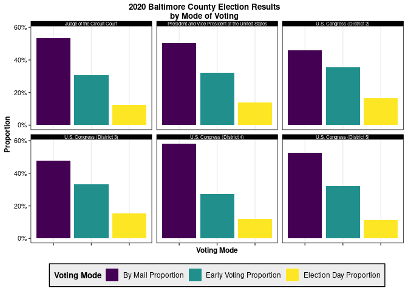

Taking the DuBois Challenge
================
Ryan Heslin
May 27, 2022


For this exercise, I’ll scrape and tidy official 2020 election results
for Baltimore County, Maryland.

``` r
library(tidyverse)
library(rvest)
url <- "https://elections.maryland.gov/elections/2020/results/General/gen_results_2020_4_by_county_04-1.html"

selectors <- c("#primary_right_col h2", "h3", ".mdgov_OverflowTable .table-stripe")
funs <- list(html_text, html_text, html_table)

raw <- read_html(url)
scraped <- map(selectors, ~ html_elements(x = raw, css = .x)) %>%
  map2(., funs, ~ rlang::exec(.fn = .y, .x))

districts <- str_match(scraped[[2]], "District\\s(\\d)+")[, 2]
inds <- which(complete.cases(districts))
districts <- districts[inds]

tidied <- scraped[[3]]
names(tidied)[inds] <- districts
```

Tidying is more involved then expected. I decide to drop a retention
election, since a yes/no vote can’t easily be represented in a table
among votes for candidates.

``` r
races <- scraped[[1]]
races <-
  c(races[1:min(inds) - 1], rep("U.S. Congress", length(inds)), races[(min(inds) +
    2):length(races) - 1])
tidied <- tidied %>%
  discard(~ names(.x)[1] != "Name") %>%
  map2(., races, ~ mutate(.x, across(c(
    where(is.character), -c(Party, Name)
  ), parse_number)) %>%
    mutate(Race = .y)) %>%
  bind_rows(.id = "District")
```

My usual plotting theme.

``` r
theme_standard <- ggplot2::theme(
  panel.background = element_blank(),
  panel.border = element_rect(color = "black", fill = NA),
  panel.grid = element_blank(), panel.grid.major.x = element_line(color = "gray93"),
  legend.background = element_rect(fill = "gray93"),
  plot.title = element_text(
    size = 15, family = "sans",
    face = "bold", vjust = 1.3
  ), plot.title.position = "plot",
  plot.subtitle = element_text(size = 10, family = "sans"),
  legend.title = element_text(
    size = 10, family = "sans",
    face = "bold"
  ), axis.title = element_text(
    size = 9,
    family = "sans", face = "bold"
  ), axis.text = element_text(
    size = 8,
    family = "sans"
  ), strip.background = element_rect(
    color = "black",
    fill = "black"
  ), strip.text.x = element_text(color = "white"),
  strip.text.y = element_text(color = "white")
)
ggplot2::theme_set(theme_standard)
```

Making the plot. The differences in relative proportions of voting mode
by congressional district are interesting.

``` r
tidied %>%
  group_by(Race, District) %>%
  summarize(across(c(`Early Voting`, `Election Day`, `By Mail`), ~ sum(.x) / sum(Total),
    .names = "{.col} Proportion"
  ), .groups = "drop") %>%
  mutate(Race = if_else(Race == "U.S. Congress", sprintf("%s (District %s)", Race, District), Race)) %>%
  select(-District) %>%
  pivot_longer(-Race, names_to = "Voting Mode", values_to = "Proportion") %>%
  ggplot(aes(x = `Voting Mode`, y = Proportion, fill = `Voting Mode`)) +
  geom_col(position = "stack") +
  scale_y_continuous(labels = scales::percent_format()) +
  facet_wrap(Race ~ ., nrow = 2, ncol = 3) +
  scale_fill_viridis_d() +
  labs(title = str_wrap("2020 Baltimore County Election Results by Mode of Voting", width = 40)) +
  theme(
    axis.text.x = element_blank(),
    legend.position = "bottom",
    plot.title = element_text(size = 10),
    strip.text = element_text(size = 6)
  )
```


