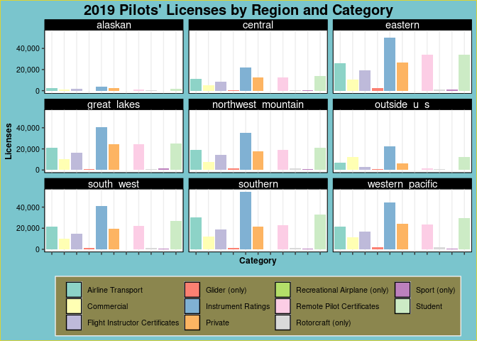

FAA Data Analysis
================
Ryan Heslin
May 27, 2022


This dataset is a nastily formatted `.xslx` table breaking down 2019 FAA
pilot licenses by region and type. To extract useful data, I’ll have to
remove useless rows and extract information from cell formatting.

``` r
library(tidyverse)
library(openxlsx)
library(tidyxl)

formats <- xlsx_formats("../data/faa.xlsx")$local$font$bold
cells <- xlsx_cells("../data/faa.xlsx") %>%
  filter(sheet == "Table 3" & str_detect(address, "^A") & local_format_id %in% which(formats) & between(row, 8, 59))
```

The raw dataset.

``` r
faa_raw <- read.xlsx("https://www.faa.gov/data_research/aviation_data_statistics/civil_airmen_statistics/media/2019-civil-airmen-stats.xlsx", sheet = 4, startRow = 6, na.strings = "N/Ap", cols = 1:11)
head(faa_raw)
```

<div class="kable-table">

| CLASS.OF.CERTIFICATE         | Total.1/ | Alaskan | Central | Eastern | Great.Lakes | Northwest.Mountain | Southern | South-.west | Western-.Pacific | Outside.U.S../2 |
| :--------------------------- | -------: | ------: | ------: | ------: | ----------: | -----------------: | -------: | ----------: | ---------------: | --------------: |
| Total–All Pilots             |   664565 |    8583 |   47246 |  109478 |       89346 |              74524 |   107320 |       87494 |            99360 |           41214 |
| Student                      |   197665 |    1986 |   13742 |   33799 |       25369 |              20773 |    33050 |       27004 |            29760 |           12182 |
| Recreational Airplane (only) |      127 |       1 |      21 |      38 |          34 |                  7 |       10 |           9 |                6 |               1 |
| Sport (only)                 |     6467 |      56 |     584 |    1086 |        1471 |                720 |      972 |         740 |              809 |              29 |
| Airplane 3/                  |       NA |      NA |      NA |      NA |          NA |                 NA |       NA |          NA |               NA |              NA |
| Private –Total               |   161105 |    2523 |   12959 |   27648 |       25498 |              18352 |    22048 |       20730 |            25115 |            6232 |

</div>

``` r
str(faa_raw)
```

    'data.frame':   64 obs. of  11 variables:
     $ CLASS.OF.CERTIFICATE: chr  "Total--All Pilots" "Student" "Recreational Airplane (only)" "Sport (only)" ...
     $ Total.1/            : num  664565 197665 127 6467 NA ...
     $ Alaskan             : num  8583 1986 1 56 NA ...
     $ Central             : num  47246 13742 21 584 NA ...
     $ Eastern             : num  109478 33799 38 1086 NA ...
     $ Great.Lakes         : num  89346 25369 34 1471 NA ...
     $ Northwest.Mountain  : num  74524 20773 7 720 NA ...
     $ Southern            : num  107320 33050 10 972 NA ...
     $ South-.west         : num  87494 27004 9 740 NA ...
     $ Western-.Pacific    : num  99360 29760 6 809 NA ...
     $ Outside.U.S../2     : num  41214 12182 1 29 NA ...

The hardest part is to identify the cells of the first column with bold
formatting, indicating categories. I do this using the openxlsx package,
then extract the category names from the relevant cells. That done, I
use those cells to fill the rest of the column. For simplicity’s sake, I
don’t bother with subcategories (e.g., commercial fixed-wing
vs. helicopter licenses)

After that, I clean up column names and delete an unnecessary row.

``` r
faa_cleaned <- faa_raw[1:53, ] %>%
  mutate(category = NA_character_)
faa_cleaned[cells$row - 6, "category"] <- str_remove(cells$character, "\\s\\d.*|\\s?-.*") %>%
  str_trim()

faa_cleaned <- faa_cleaned %>%
  fill(category, .direction = "down") %>%
  rename_with(~ str_to_lower(.x) %>%
    str_replace_all("-?\\.", "_") %>%
    str_remove_all("_[^a-zA-Z]+")) %>%
  filter(!str_detect(class_of_certificate, "Total|^Airplane")) %>%
  mutate(str_remove(category, "\\sCetificates"))
```

From then on it’s an easy pivoting job.

``` r
faa_cleaned <- faa_cleaned %>%
  select(-total) %>%
  pivot_longer(cols = alaskan:outside_u_s, names_to = "Region", values_to = "Licenses")
```

Now to actually plot the thing.

``` r
p1 <- faa_cleaned %>%
  ggplot(aes(x = category, y = Licenses, fill = category)) +
  geom_col(position = "dodge") +
  facet_wrap(~Region) +
  theme(
    legend.position = "bottom",
    axis.text.x = element_blank(),
    legend.text = element_text(size = 8),
    legend.title = element_blank(),
    legend.background = element_rect(fill = "khaki4", color = "gray93"),
    plot.background = element_rect(fill = "cadetblue3", color = "gold"),
    strip.text = element_text(color = "white"),
    strip.background = element_rect(fill = "black"),
    panel.background = element_rect(fill = "white")
  ) +
  scale_y_continuous(labels = scales::comma_format()) +
  scale_fill_brewer(palette = "Set3") +
  labs(x = "Category", title = "2019 Pilots' Licenses by Region and Category") +
  guides(fill = guide_legend(override.aes = list(color = "black"))) +
  theme(plot.title.position = "plot")
p1
```



``` r
ggsave("faa1.png", plot = p1, path = "../outputs/plots")
```
