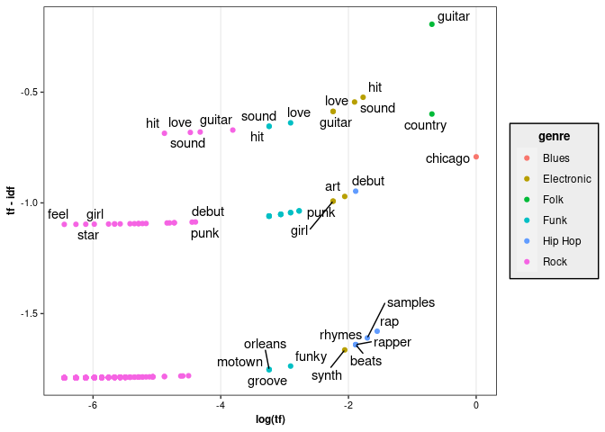
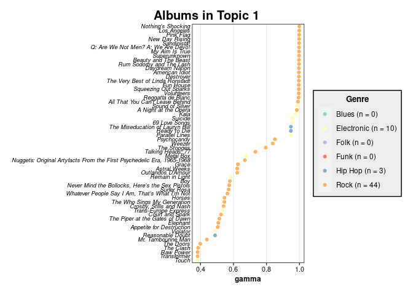
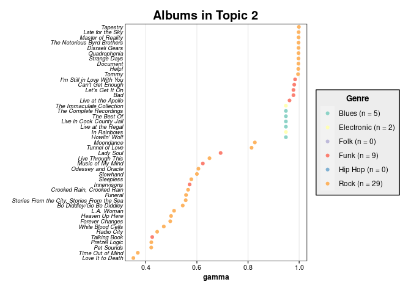
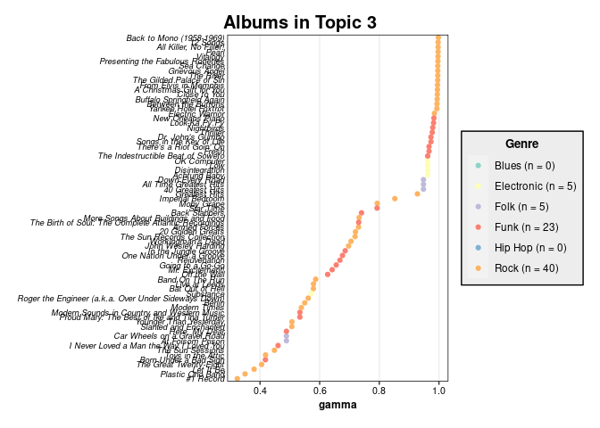
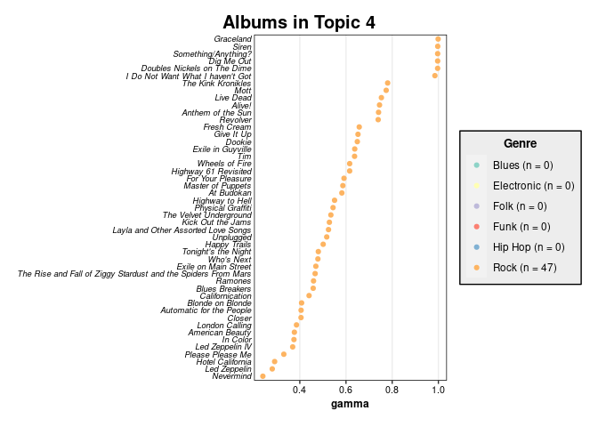
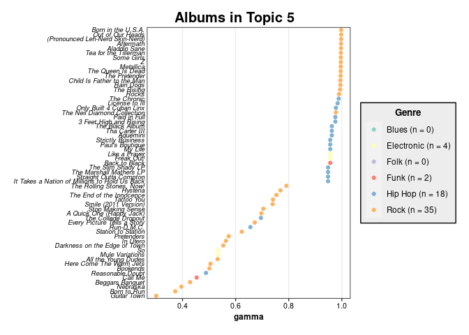
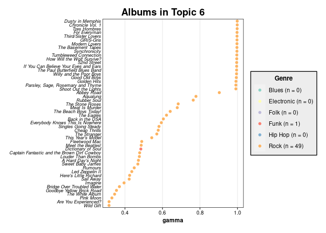
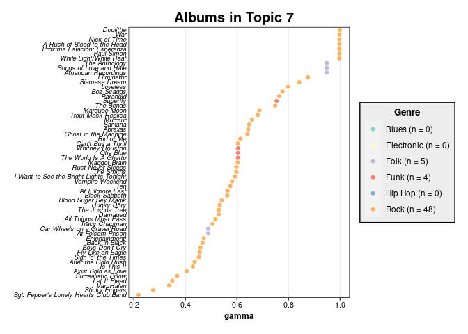
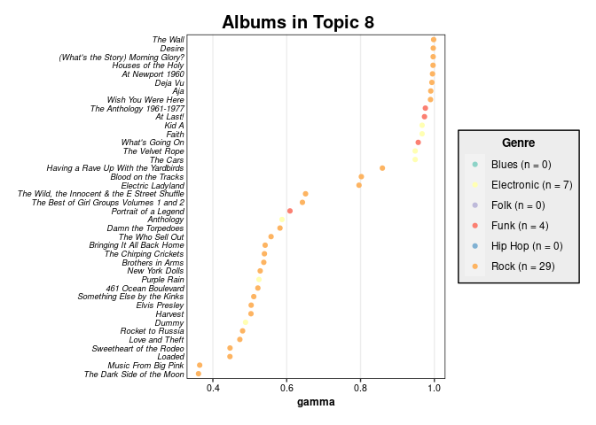
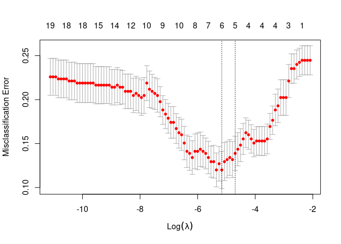

Greatest Albums Analysis
================
Ryan Heslin
May 27, 2022


``` r
library(tidyverse)
library(rlang)
library(rvest)
library(RSelenium)
```

# Scraping the Data

Today I’ll attempt to classify album genres using text analysis. The
data come from [Rolling Stone’s 2003
list](https://www.rollingstone.com/music/music-lists/500-greatest-albums-of-all-time-156826/)
of the “500 Greatest Albums of All time.” The magazine released an
updated list last year, possibly in response to persistent criticisms
that it overrepresented male-dominated classic rock.

I don’t place too much stock in these kinds of rankings, but this one
does provide an interesting web scraping and modeling challenge.

``` r
genres_raw <- read_csv("../data/albumlist.csv")
genres_raw %>%
  count(Album, sort = TRUE) %>%
  filter(n > 1)
```

<div class="kable-table">

| Album         | n |
| :------------ | -: |
| Greatest Hits | 3 |
| Let It Be     | 2 |

</div>

It seems there are three Greatest Hits albums (not surprising) and a
second *Let It Be* (unexpected). Luckily, year is enough to distinguish
them.

``` r
genres_raw %>% filter(Album %in% c("Greatest Hits", "Let It Be"))
```

<div class="kable-table">

| Number | Year | Album         | Artist                 | Genre       | Subgenre                                      |
| -----: | ---: | :------------ | :--------------------- | :---------- | :-------------------------------------------- |
|     52 | 1975 | Greatest Hits | Al Green               | Funk / Soul | Soul                                          |
|     61 | 1970 | Greatest Hits | Sly & The Family Stone | Funk / Soul | Rhythm & Blues, Funk                          |
|    136 | 1974 | Greatest Hits | Elton John             | Rock        | Classic Rock                                  |
|    241 | 1984 | Let It Be     | The Replacements       | Rock        | Alternative Rock, Power Pop, Punk, Indie Rock |
|    392 | 1970 | Let It Be     | The Beatles            | Rock        | Pop Rock                                      |

</div>

``` r
genres <- rename_with(genres_raw, str_to_lower)
```

acylam from the `discoRd` sever helped me configure the driver and
suggested code for the page scraping.

A previous version of this analysis used a remote firefox server in a
docker container mapped to port 4445 by pasting this into a terminal:

`docker run -d -p 4445:4444 selenium/standalone-firefox:2.53.1`

but you can reproduce it more easily simply by installing Selenium and
geckodriver.

``` r
library(RSelenium)
driver <- rsDriver(browser = "firefox", port = 4415L)
# driver <- remoteDriver(
# remoteServerAddr = "localhost",
# port = 4445L,
# browserName = "firefox"
# )

# driver$open()
driver <- driver$client
```

I define some functions to simplify scraping.

``` r
scrape_page <- function(driver,
                        url,
                        wait = 5L,
                        sel) {
  driver$navigate(url)

  Sys.sleep(wait)
  html_raw <- driver$getPageSource()[[1]]
  cat("Scraping", url, "\n")
  html2text(html_raw, sel)
}

html2text <- function(html_obj, sel, type = "css") {
  html <- read_html(html_obj)
  purrr::map(sel, get_html_elements, html = html)
}

get_html_elements <- function(html, sel) {
  html_text(html_elements(x = html, css = sel))
}
```

``` r
driver$navigate(url)
links <- driver$getPageSource()[[1]] %>%
  read_html() %>%
  html_elements(css = "#pmc-gallery-list-nav-bar-render a") %>%
  html_attr("href")
```

Some descriptions on a few pages don’t have the vertical gallery class,
requiring me to manually add another selector. Resolving this one
special case took as much time as the rest of the script.

    [[1]]
    [1] ":nth-child(43) p , #pmc-gallery-vertical p:nth-child(2)"
    
    [[2]]
    [1] ":nth-child(43) p , #pmc-gallery-vertical p:nth-child(2)"
    
    [[3]]
    [1] ":nth-child(43) p , #pmc-gallery-vertical p:nth-child(2)"

The actual scraping. It takes a long time.

``` r
text_raw <- mapply(function(link, sel) scrape_page(driver, link, wait = 2.5, sel = sel), pages$link, pages$sel, SIMPLIFY = FALSE)
```

    Scraping https://www.rollingstone.com/music/music-lists/500-greatest-albums-of-all-time-156826/outkast-aquemini-2-155441 
    Scraping https://www.rollingstone.com/music/music-lists/500-greatest-albums-of-all-time-156826/jackson-browne-for-everyman-38302 
    Scraping https://www.rollingstone.com/music/music-lists/500-greatest-albums-of-all-time-156826/the-temptations-anthology-152489 
    Scraping https://www.rollingstone.com/music/music-lists/500-greatest-albums-of-all-time-156826/the-yardbirds-roger-the-engineer-a-k-a-over-under-sideways-down-46344 
    Scraping https://www.rollingstone.com/music/music-lists/500-greatest-albums-of-all-time-156826/black-sabbath-master-of-reality-32210 
    Scraping https://www.rollingstone.com/music/music-lists/500-greatest-albums-of-all-time-156826/jay-z-reasonable-doubt-3-170429 
    Scraping https://www.rollingstone.com/music/music-lists/500-greatest-albums-of-all-time-156826/ac-dc-highway-to-hell-2-161525 
    Scraping https://www.rollingstone.com/music/music-lists/500-greatest-albums-of-all-time-156826/bruce-springsteen-darkness-on-the-edge-of-town-162503 
    Scraping https://www.rollingstone.com/music/music-lists/500-greatest-albums-of-all-time-156826/the-zombies-odessey-and-oracle-172848 
    Scraping https://www.rollingstone.com/music/music-lists/500-greatest-albums-of-all-time-156826/little-richard-heres-little-richard-165415 

``` r
tryCatch(driver$close(), error = function() {})
```

``` r
load("../data/albums_scrape.Rdata")

library(tidyverse)

theme_standard <- ggplot2::theme(
  panel.background = element_blank(),
  panel.border = element_rect(color = "black", fill = NA),
  panel.grid = element_blank(),
  panel.grid.major.x = element_line(color = "gray93"),
  legend.background = element_rect(fill = "gray93"),
  plot.title = element_text(
    size = 15,
    family = "sans",
    face = "bold",
    vjust = 1.3
  ),
  plot.title.position = "plot",
  plot.subtitle = element_text(size = 10, family = "sans"),
  legend.title = element_text(
    size = 10,
    family = "sans",
    face = "bold"
  ),
  axis.title = element_text(
    size = 9,
    family = "sans",
    face = "bold"
  ),
  axis.text = element_text(
    size = 8,
    family = "sans"
  ),
  strip.background = element_rect(
    color = "black",
    fill = "black"
  ),
  strip.text.x = element_text(color = "white"),
  strip.text.y = element_text(color = "white")
)
ggplot2::theme_set(theme_standard)

albums <- text_raw %>%
  map(bind_cols) %>%
  bind_rows() %>%
  separate(artist_album,
    sep = ",\\s(?=\\')|\\s,|'\\s'",
    # special cases
    into = c("artist", "album")
  ) %>%
  separate(
    label_year,
    sep = ",\\s",
    into = c("label", "year"),
    convert = TRUE
  ) %>%
  mutate(
    rank = nrow(.):1,
    across(where(is.character), ~ str_remove_all(.x, "\\\"|^\\'|\\'$"))
  )
```

I recode some faulty years.

``` r
recodes <- exprs(
  album == "Tumbleweed Connection" ~ 1970,
  album == "CrazySexyCool" ~ 1994,
  album == "The Blueprint" ~ 2001,
  TRUE ~ year
)
albums <- albums %>% mutate(year = case_when(!!!recodes))
```

A major problem appears. 351 albums have rock listed as a genre, so that
class is overwhelmingly predominant.

``` r
sum(str_detect(albums$genre, "Rock"))
```

    [1] 0

Luckily, rank is a unique key, saving me a potentially nasty fuzzy join.

``` r
genres <- genres %>%
  select(number, genre, subgenre) %>%
  mutate(genre = str_replace_all(
    genre,
    c(
      "\\s(/|\\\\)\\s" = ", ",
      ",J" = ", ",
      "Folk, World, & Country" = "Folk"
    )
  ))

albums <-
  left_join(albums,
    genres,
    by = c(rank = "number")
  )


library(tidytext)


by_word <- albums %>%
  separate_rows(genre, sep = ",\\s")
custom_stops <- c(
  "song",
  "songs",
  "album",
  "albums",
  "music",
  "band",
  "record",
  "track",
  "hip",
  "hop",
  "",
  str_to_lower(unique(by_word$genre))
)

by_word <- by_word %>%
  unnest_tokens(word, description) %>%
  filter(!word %in% c(stop_words$word, custom_stops))
```

I elect to break some compound genres like “Funk /Soul” into individual
pieces. Counting words, they overwhelmingly come from the rock genre.

``` r
count(by_word, genre, sort = TRUE)
```

<div class="kable-table">

| genre          |     n |
| :------------- | ----: |
| Rock           | 10238 |
| Funk           |  2291 |
| Soul           |  2291 |
| Pop            |  1337 |
| Blues          |  1132 |
| Electronic     |  1083 |
| Folk           |   910 |
| Hip Hop        |   850 |
| Jazz           |   642 |
| Stage & Screen |   282 |
| Reggae         |   280 |
| Latin          |   120 |
| Classical      |    58 |

</div>

``` r
count(by_word, word, genre, sort = TRUE) %>%
  slice_head(n = 10)
```

<div class="kable-table">

| word      | genre |  n |
| :-------- | :---- | -: |
| guitar    | Rock  | 86 |
| punk      | Rock  | 47 |
| love      | Rock  | 46 |
| sound     | Rock  | 44 |
| debut     | Rock  | 41 |
| guitarist | Rock  | 40 |
| john      | Rock  | 37 |
| roll      | Rock  | 34 |
| studio    | Rock  | 34 |
| time      | Rock  | 33 |

</div>

The most common words in each genre look as we’d expect, but some
overlap.

``` r
by_word %>%
  group_by(genre, word) %>%
  summarize(count = n()) %>%
  slice_max(order_by = count, n = 3) %>%
  filter(!genre %in% c("Classical", "Stage & Screen")) %>%
  arrange(genre, -count) %>%
  head(10)
```

<div class="kable-table">

| genre      | word    | count |
| :--------- | :------ | ----: |
| Blues      | guitar  |     9 |
| Blues      | live    |     8 |
| Blues      | chicago |     6 |
| Blues      | eric    |     6 |
| Blues      | sound   |     6 |
| Electronic | hit     |     8 |
| Electronic | girl    |     7 |
| Electronic | sound   |     7 |
| Folk       | country |    12 |
| Folk       | guitar  |    10 |

</div>

I drop uncommon genres and code each album as the first genre listed -
arbitrary but consistent.

``` r
drop_genres <-
  c("Classical", "Latin", "Stage & Screen", "Reggae", "Jazz")
word_genre <- by_word %>%
  filter(!genre %in% drop_genres) %>%
  distinct(artist, album, word, .keep_all = TRUE) %>%
  add_count(genre, word) %>%
  filter(n > 4)
```

The funk and hip-hop clusters are most apparent.

``` r
library(ggrepel)
word_genre %>%
  count(genre, word) %>%
  bind_tf_idf(term = word, document = genre, n = n) %>%
  ggplot(aes(
    x = log(tf),
    y = tf - idf,
    label = word
  )) +
  geom_point(aes(color = genre)) +
  geom_text_repel()
```



``` r
library(topicmodels)
```

To get a closer look at the structure of the data, I fit an LDA topic
model with 8 topics, one for each genre of interest. The documents are
the album descriptions.

``` r
lda <-
  word_genre %>%
  cast_dtm(
    document = album,
    term = word,
    value = n
  ) %>%
  LDA(k = 8)
```

Plots show some topics seem to have captured most of one genre, but
others are more dispersed (remember a document can contain multiple
topics)

``` r
pal <-
  RColorBrewer::brewer.pal(n_distinct(word_genre$genre), "Set3")
plots <- tidy(lda, matrix = "gamma") %>%
  left_join(distinct(word_genre, album, .keep_all = TRUE),
    by = c(document = "album")
  ) %>%
  group_by(document) %>%
  slice_max(n = 1, order_by = gamma) %>%
  ungroup() %>%
  mutate(genre = factor(genre)) %>%
  group_by(topic) %>%
  group_map(function(.x, .y) {
    counts <- unname(table(.x$genre))
    ggplot(.x, aes(
      x = fct_reorder(document, gamma),
      y = gamma,
      color = genre
    )) +
      geom_point() +
      scale_color_manual(
        drop = FALSE,
        breaks = waiver(),
        values = pal,
        labels = function(x) {
          paste0(x, " (n = ", counts, ")")
        }
      ) +
      coord_flip() +
      labs(title = paste("Albums in Topic", .y), x = NULL, color = "Genre") +
      theme(
        axis.text.y = element_text(size = 7, face = "italic", hjust = 1), axis.ticks.y = element_blank(),
        plot.margin = unit(rep(.5, 4), "cm"),
      )
  }, .keep = TRUE)

walk(plots, print)
```



One topic per genre is probably too many, given the predominance of rock
albums.

``` r
enframe(get_topics(lda), name = "album", value = "topic") %>%
  mutate(top_word = get_terms(lda)[match(topic, as.character(seq_along(get_terms(lda))))]) %>%
  right_join(albums, by = "album") %>%
  select(album, artist, genre, topic, top_word) %>%
  head(10)
```

<div class="kable-table">

| album                    | artist            | genre             | topic | top\_word |
| :----------------------- | :---------------- | :---------------- | ----: | :-------- |
| Aquemini                 | OutKast           | Hip Hop           |     5 | title     |
| Live in Cook County Jail | B.B. King         | Blues             |     2 | love      |
| The Stone Roses          | The Stone Roses   | Rock              |     6 | john      |
| White Blood Cells        | The White Stripes | Rock              |     2 | love      |
| Boz Scaggs               | Boz Scaggs        | Rock              |     7 | guitar    |
| Give It Up               | Bonnie Raitt      | Rock              |     4 | guitarist |
| Yankee Hotel Foxtrot     | Wilco             | Rock              |     3 | sound     |
| Touch                    | Eurythmics        | Electronic, Pop   |     1 | debut     |
| Born Under a Bad Sign    | Albert King       | Funk, Soul, Blues |     3 | sound     |
| Tres Hombres             | ZZ Top            | Rock              |     6 | john      |

</div>

I next try to fit a lasso model, useful here to filter irrelevant
predictors. Inspired by
[this](https://www.youtube.com/watch?v=3PecUbnuYC4&t=6s) Tidy Tuesday
screencast.

I’m not concerned with prediction and the data are sparse, so I don’t
create test and training sets.

``` r
library(glmnet)

set.seed(1111)
sparse <- word_genre %>% cast_sparse(album, word, n)

y <- word_genre$genre[match(rownames(sparse), word_genre$album)]

mod <- cv.glmnet(sparse,
  y,
  family = "multinomial",
  type.measure = "class",
  nfolds = 15
)

plot(mod)
```



The optimal value of lambda turn out to be:

``` r
mod$lambda.min
```

    [1] 0.005723921

The deviance ratio (proportion of deviance) for the best model is pretty
high, indicating we don’t improve much on the null model. The highest
coefficients, though,make sense, such as “motown” for funk.

``` r
top_terms <- tidy(mod$glmnet.fit) %>%
  group_by(term) %>%
  filter(lambda == mod$lambda.min) %>%
  slice_max(order_by = abs(estimate), n = 1) %>%
  ungroup() %>%
  arrange(-abs(estimate))

head(top_terms, 15)
```

<div class="kable-table">

| class      | term    | step |    estimate |    lambda | dev.ratio |
| :--------- | :------ | ---: | ----------: | --------: | --------: |
| Blues      |         |   34 | \-3.0418377 | 0.0057239 | 0.7919094 |
| Blues      | chicago |   34 |   1.6605175 | 0.0057239 | 0.7919094 |
| Hip Hop    | rapper  |   34 |   0.9407116 | 0.0057239 | 0.7919094 |
| Hip Hop    | rhymes  |   34 |   0.9368607 | 0.0057239 | 0.7919094 |
| Hip Hop    | samples |   34 |   0.8395658 | 0.0057239 | 0.7919094 |
| Hip Hop    | beats   |   34 |   0.7708574 | 0.0057239 | 0.7919094 |
| Funk       | motown  |   34 |   0.7305693 | 0.0057239 | 0.7919094 |
| Hip Hop    | rap     |   34 |   0.7076595 | 0.0057239 | 0.7919094 |
| Rock       | wall    |   34 |   0.7058139 | 0.0057239 | 0.7919094 |
| Funk       | groove  |   34 |   0.6528224 | 0.0057239 | 0.7919094 |
| Funk       | orleans |   34 |   0.6449321 | 0.0057239 | 0.7919094 |
| Electronic | synth   |   34 |   0.6385866 | 0.0057239 | 0.7919094 |
| Rock       | u2      |   34 |   0.5125709 | 0.0057239 | 0.7919094 |
| Rock       | bad     |   34 |   0.4344310 | 0.0057239 | 0.7919094 |
| Rock       | arena   |   34 |   0.4285441 | 0.0057239 | 0.7919094 |

</div>

The most striking associations are for hip-hop, with words like “beats”,
“jam”, and “sample” that make sense. The words for rock, far and away
the dominant genre, are less focused, and include some names.

``` r
coef.glmnet(mod, s = mod$lambda.min) %>%
  map_dfr(tidy, .id = "genre") %>%
  arrange(-abs(value)) %>%
  select(-column) %>%
  head(10)
```

<div class="kable-table">

| genre      | row         |       value |
| :--------- | :---------- | ----------: |
| Blues      | (Intercept) | \-3.0418377 |
| Blues      | chicago     |   1.6605175 |
| Rock       | (Intercept) |   1.1858739 |
| Electronic | (Intercept) |   0.9882621 |
| Funk       | (Intercept) |   0.9697948 |
| Hip Hop    | rapper      |   0.9407116 |
| Hip Hop    | rhymes      |   0.9368607 |
| Hip Hop    | samples     |   0.8395658 |
| Hip Hop    | beats       |   0.7708574 |
| Funk       | motown      |   0.7305693 |

</div>

``` r
pred <- predict(mod, sparse, s = mod$lambda.min, type = "class")
```

The model, which naturally classified most albums as rock, the dominant
class, mostly misclassifies albums for which rock is a secodnary genre.

``` r
tibble(
  pred = pred,
  actual = y,
  album = rownames(sparse)
) %>%
  right_join(albums, by = "album") %>%
  filter(pred != actual) %>%
  select(pred, actual, album, artist, subgenre)
```

<div class="kable-table">

| pred | actual     | album                           | artist               | subgenre                                          |
| :--- | :--------- | :------------------------------ | :------------------- | :------------------------------------------------ |
| Rock | Folk       | All Time Greatest Hits          | Loretta Lynn         | Country                                           |
| Rock | Folk       | Down Every Road                 | Merle Haggard        | Country                                           |
| Rock | Funk       | Back to Black                   | Amy Winehouse        | Soul                                              |
| Rock | Folk       | American Recordings             | Johnny Cash          | Country, Gospel, Folk                             |
| Rock | Electronic | Substance                       | New Order            | Synth-pop                                         |
| Rock | Electronic | In Rainbows                     | Radiohead            | Alternative Rock, Art Rock                        |
| Rock | Electronic | Disintegration                  | The Cure             | New Wave, Alternative Rock                        |
| Rock | Hip Hop    | The Miseducation of Lauryn Hill | Lauryn Hill          | RnB/Swing, Conscious                              |
| Rock | Folk       | Car Wheels on a Gravel Road     | Lucinda Williams     | Country, Folk                                     |
| Rock | Folk       | Songs of Love and Hate          | Leonard Cohen        | Folk Rock, Folk, Ballad                           |
| Rock | Electronic | Low                             | David Bowie          | Art Rock, Ambient, Experimental                   |
| Rock | Electronic | The Immaculate Collection       | Madonna              | Synth-pop                                         |
| Rock | Electronic | OK Computer                     | Radiohead            | Alternative Rock                                  |
| Rock | Electronic | Parallel Lines                  | Blondie              | New Wave, Pop Rock, Punk, Disco                   |
| Rock | Hip Hop    | Ready to Die                    | The Notorious B.I.G. | Thug Rap                                          |
| Rock | Electronic | Remain in Light                 | Talking Heads        | New Wave, Art Rock, Funk                          |
| Rock | Folk       | 40 Greatest Hits                | Hank Williams        | Country                                           |
| Rock | Folk       | At Folsom Prison                | Johnny Cash          | Country                                           |
| Rock | Electronic | Achtung Baby                    | U2                   | Pop Rock, Synth-pop, Alternative Rock, Arena Rock |
| Rock | Folk       | The Anthology                   | Muddy Waters         | Folk                                              |

</div>
